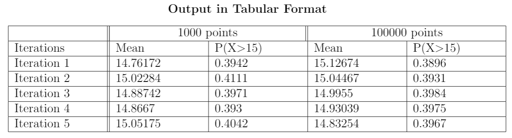

```{r, echo = FALSE}
knitr::opts_chunk$set(fig.path='Figs/')
```

## R Markdown

**Q.1-b) i.} Simulate one draw of the block lifetimes $X_A$ and $X_B$. Use these draws to simulate one draw of the satellite lifetime T.**

```{r}
xa = rexp(1,0.1)
xb = rexp(1,0.1)
t = max(xa,xb)
cat("Xa = ", xa)
cat("Xb = ", xb)
cat("T = ", t)
```

{Q.1-b) ii.} Repeat the previous step 10,000 times. This will give you 10,000 draws
from the distribution of T. Try to avoid ‘for’ loop. Use ‘replicate’ function
instead. Save these draws for reuse in later steps. [Bonus: 1 bonus point
for not taking more than 1 line of code for steps (i) and (ii).]

```{r}
t<-replicate(10000, max(rexp(1,0.1), rexp(1,0.1)))
print(head(t))
```


Q.1-b) iii.} Make a histogram of the draws of T using ‘hist’ function. Superimpose the density function given above. 
```{r}
hist(t)
hist(t, probability = t)
f_t <- function(x) 0.2*exp(-0.1*x) - 0.2*exp(-0.2*x)
curve(f_t, add = T, xlab = "t", ylab = "density")
```

```{r}
mean(t) ## computed E(T)
```

Exact answer is 15. The obtained answer is quite close to the calculated one.

```{r}
cdf <- ecdf(t)
```

```{r}
## probab that satellite lasts more than 15 years is
print(1-cdf(15))       ## my answer 0.397
```

Exact answer is 0.397. The obtained answer is quite close to the calculated one.


```{r}
## whole process four times

for(i in 1:4){
  
  t<-replicate(10000, max(rexp(1,0.1), rexp(1,0.1)))
  
  cat("E(T) is",mean(t), "\n") ## computed E(T)
  
  cdf <- ecdf(t)
  cdf(15)
  
  ## probab that satellite lasts more than 15 years is
  cat("Probability that satellite lasts more than 15 years is" , 1-cdf(15), "\n")## my answer 0.397
}
```

There is no pattern in the mean and P(X$<$15) as the number of iterations increase

**Q.1-c)Repeat part (vi) five times using 1,000 and 100,000 Monte Carlo replications instead of 10,000. Make a table of results. Comment on what you see and
provide an explanation**

```{r}
c_part <- function(number_of_points, number_of_times){
  # Vector containing mean of all points
  mean.vector <- vector()
  # Vector containing P(X<15) of all points 
  pdf.15 <- vector()
  for(i in 1:number_of_times){
    
    t<-replicate(10000, max(rexp(1,0.1), rexp(1,0.1)))
    
    mean.vector<-append(mean.vector,mean(t)) ## computed E(T)
  
    cdf <- ecdf(t)
  
    ## probab that satellite lasts more than 15 years is
    pdf.15<-append(pdf.15,1-cdf(15))## my answer 0.397
  }
  return (list("mean" = mean.vector, "pdf" = pdf.15))
}
```


Mean and the P(X $>$ 15) is more accurate when the number of points increases. Mean of 100k points is lot closer to 15 than mean of 1k points. Also for P(X $>$ 15), the value is lot closer to 0.396 in case of 100k points as compared to 1k points.
 
```{r}
cat("E(T) of 1000 Points 5 times is ",c_part(1000,5)$mean, "\n") ## computed E(T)
```

```{r}
cat("P(X<15) of 1000 Points 5 times is ",c_part(1000,5)$pdf, "\n") ## computed P(X<15)
```

```{r}
cat("E(T) of 100000 Points 5 times is ",c_part(100000,5)$mean, "\n") ## computed E(T)
cat("P(X<15) of 100000 Points 5 times is ",c_part(100000,5)$pdf, "\n") ## computed P(X<15)
```

Q.2) } Use a Monte Carlo approach estimate the value of π based on 10,000
replications. [Ignorable hint: First, get a relation between π and the probability
that a randomly selected point in a unit square with coordinates — (0, 0), (0, 1),
(1, 0), and (1, 1) — falls in a circle with center (0.5, 0.5) inscribed in the square.
Then, estimate this probability, and go from there.

```{r}
## 2nd question
n<-10000          # number of replications i.e number of points

# Randomized Uniform distribution to choose 10000 between 0 and 1
# Points whose x or y greater than 1 would lie outside the square
x<-runif(n,0,1)   
y<-runif(n,0,1)

# satisfying_equation is a boolean vector which contains true if point is inside circle else false
satisfying_equation <-((x-0.5)^2+(y-0.5)^2<=0.25)

# inside.circle consists of all points inside the circle
inside.circle<-sum(satisfying_equation)

# outside.circle consists of all points outside the circle
outside.circle<-(n-inside.circle)

# Finding the value of pi by dividing the number of points inside the circle divide by total number of points
pi_mc<-(inside.circle/n)*4
pi_mc
```

