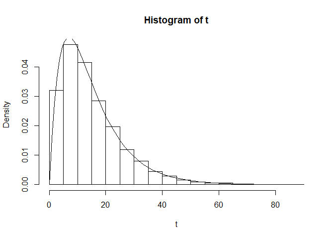

    knitr::opts_chunk$set(fig.path='Figs/')

R Markdown
----------

**Q.1-b) i.} Simulate one draw of the block lifetimes *X**A*
and *X**B*. Use these draws to simulate one draw of the
satellite lifetime T.**

    xa = rexp(1,0.1)
    xb = rexp(1,0.1)
    t = max(xa,xb)
    cat("Xa = ", xa)

    ## Xa =  26.17549

    cat("Xb = ", xb)

    ## Xb =  2.329167

    cat("T = ", t)

    ## T =  26.17549

{Q.1-b) ii.} Repeat the previous step 10,000 times. This will give you
10,000 draws from the distribution of T. Try to avoid ‘for’ loop. Use
‘replicate’ function instead. Save these draws for reuse in later steps.
\[Bonus: 1 bonus point for not taking more than 1 line of code for steps
(i) and (ii).\]

    t<-replicate(10000, max(rexp(1,0.1), rexp(1,0.1)))
    print(head(t))

    ## [1]  7.376280 12.372153 11.647460 16.736535  5.042813 24.192062

Q.1-b) iii.} Make a histogram of the draws of T using ‘hist’ function.
Superimpose the density function given above.

    hist(t)

    hist(t, probability = t)

    ## Warning in if (freq) x$counts else x$density: the condition has length > 1 and
    ## only the first element will be used

    ## Warning in if (!freq) "Density" else "Frequency": the condition has length > 1
    ## and only the first element will be used

    f_t <- function(x) 0.2*exp(-0.1*x) - 0.2*exp(-0.2*x)
    curve(f_t, add = T, xlab = "t", ylab = "density")

    mean(t) ## computed E(T)

    ## [1] 14.86543

Exact answer is 15. The obtained answer is quite close to the calculated
one.

    cdf <- ecdf(t)

    ## probab that satellite lasts more than 15 years is
    print(1-cdf(15))       ## my answer 0.397

    ## [1] 0.3956

Exact answer is 0.397. The obtained answer is quite close to the
calculated one.

    ## whole process four times

    for(i in 1:4){
      
      t<-replicate(10000, max(rexp(1,0.1), rexp(1,0.1)))
      
      cat("E(T) is",mean(t), "\n") ## computed E(T)
      
      cdf <- ecdf(t)
      cdf(15)
      
      ## probab that satellite lasts more than 15 years is
      cat("Probability that satellite lasts more than 15 years is" , 1-cdf(15), "\n")## my answer 0.397
    }

    ## E(T) is 14.92751 
    ## Probability that satellite lasts more than 15 years is 0.3921 
    ## E(T) is 14.95102 
    ## Probability that satellite lasts more than 15 years is 0.3944 
    ## E(T) is 15.02087 
    ## Probability that satellite lasts more than 15 years is 0.396 
    ## E(T) is 14.94847 
    ## Probability that satellite lasts more than 15 years is 0.3957

There is no pattern in the mean and P(X$&lt;$15) as the number of
iterations increase

**Q.1-c)Repeat part (vi) five times using 1,000 and 100,000 Monte Carlo
replications instead of 10,000. Make a table of results. Comment on what
you see and provide an explanation**

    c_part <- function(number_of_points, number_of_times){
      # Vector containing mean of all points
      mean.vector <- vector()
      # Vector containing P(X<15) of all points 
      pdf.15 <- vector()
      for(i in 1:number_of_times){
        
        t<-replicate(10000, max(rexp(1,0.1), rexp(1,0.1)))
        
        mean.vector<-append(mean.vector,mean(t)) ## computed E(T)
      
        cdf <- ecdf(t)
      
        ## probab that satellite lasts more than 15 years is
        pdf.15<-append(pdf.15,1-cdf(15))## my answer 0.397
      }
      return (list("mean" = mean.vector, "pdf" = pdf.15))
    }

 Mean and the P(X &gt; 15) is more
accurate when the number of points increases. Mean of 100k points is lot
closer to 15 than mean of 1k points. Also for P(X &gt; 15), the value is
lot closer to 0.396 in case of 100k points as compared to 1k points.

    cat("E(T) of 1000 Points 5 times is ",c_part(1000,5)$mean, "\n") ## computed E(T)

    ## E(T) of 1000 Points 5 times is  15.1767 15.19976 14.98551 15.12384 14.88533

    cat("P(X<15) of 1000 Points 5 times is ",c_part(1000,5)$pdf, "\n") ## computed P(X<15)

    ## P(X<15) of 1000 Points 5 times is  0.3956 0.3977 0.3995 0.4026 0.3969

    cat("E(T) of 100000 Points 5 times is ",c_part(100000,5)$mean, "\n") ## computed E(T)

    ## E(T) of 100000 Points 5 times is  14.90487 14.88768 15.01199 15.0894 14.98981

    cat("P(X<15) of 100000 Points 5 times is ",c_part(100000,5)$pdf, "\n") ## computed P(X<15)

    ## P(X<15) of 100000 Points 5 times is  0.4045 0.4021 0.3984 0.3936 0.4043

Q.2) } Use a Monte Carlo approach estimate the value of π based on
10,000 replications. \[Ignorable hint: First, get a relation between π
and the probability that a randomly selected point in a unit square with
coordinates — (0, 0), (0, 1), (1, 0), and (1, 1) — falls in a circle
with center (0.5, 0.5) inscribed in the square. Then, estimate this
probability, and go from there.

    ## 2nd question
    n<-10000          # number of replications i.e number of points

    # Randomized Uniform distribution to choose 10000 between 0 and 1
    # Points whose x or y greater than 1 would lie outside the square
    x<-runif(n,0,1)   
    y<-runif(n,0,1)

    # satisfying_equation is a boolean vector which contains true if point is inside circle else false
    satisfying_equation <-((x-0.5)^2+(y-0.5)^2<=0.25)

    # inside.circle consists of all points inside the circle
    inside.circle<-sum(satisfying_equation)

    # outside.circle consists of all points outside the circle
    outside.circle<-(n-inside.circle)

    # Finding the value of pi by dividing the number of points inside the circle divide by total number of points
    pi_mc<-(inside.circle/n)*4
    pi_mc

    ## [1] 3.1388
