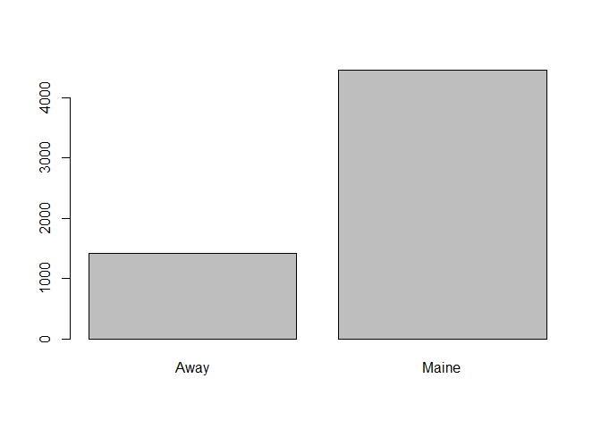
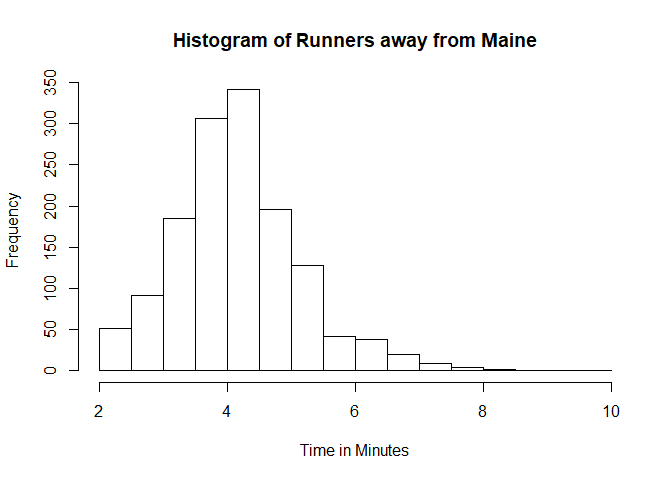
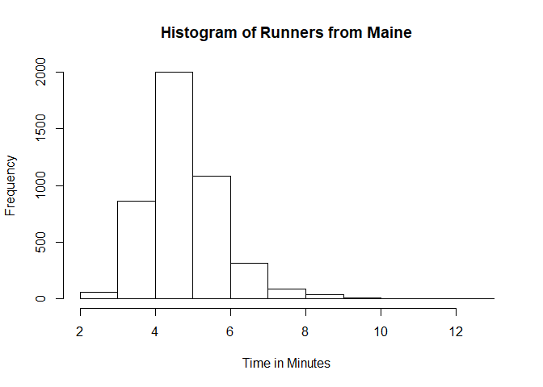
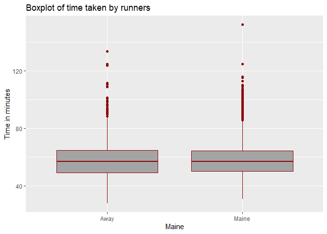
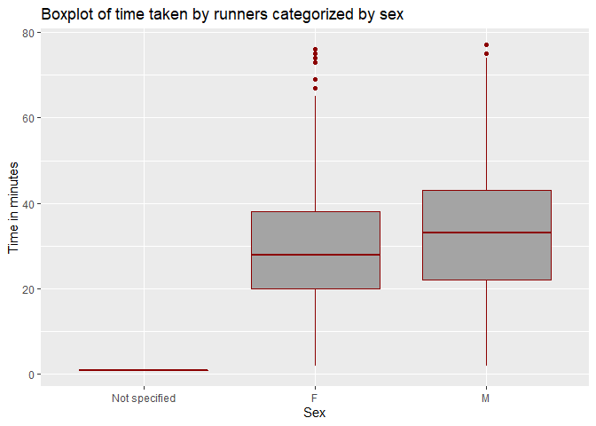
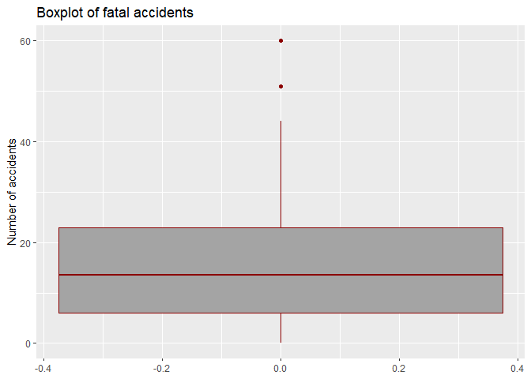
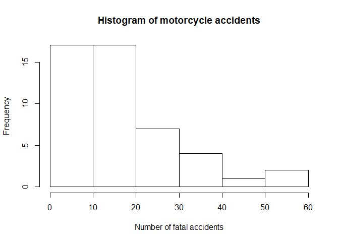

## R Markdown

**Q.1-b) i.} Simulate one draw of the block lifetimes $X_A$ and $X_B$. Use these draws to simulate one draw of the satellite lifetime T.**


```r
roadrace <- read.csv(file = "./data/roadrace.csv")
```

**Q.1-a) Create a bar graph of the variable Maine, which identifies whether a runner is from Maine or from somewhere else (stated using Maine and Away). You can use barplot function for this. What can we conclude from the plot? Back up your conclusions with relevant summary statistics.**


```r
count.maine <- table(roadrace$Maine)

## Q 1 a
barplot(count.maine)
```

<!-- -->

There are more runners who are from Maine as compared to the number of runners away from Maine. The number of runners from Maine is 3041 more than number of runners away from Maine.

**Q.1-b) Create two histograms the runners’ times (given in minutes) — one for the Maine group and the second for the Away group. Make sure that the histograms on the same scale. What can we conclude about the two distributions? Back up your conclusions with relevant summary statistics, including mean, standard deviation, range, median, and interquartile range.**


```r
away.Maine <- roadrace[which(roadrace$Maine == 'Away'),]
in.Maine <- roadrace[which(roadrace$Maine == 'Maine'),]

hist(away.Maine$Time..minutes./sd((away.Maine$Time..minutes.)), xlab = "Time in Minutes",main = "Histogram of Runners away from Maine")
```

<!-- -->


```r
hist(in.Maine$Time..minutes./sd((in.Maine$Time..minutes.)), xlab = "Time in Minutes",main = "Histogram of Runners from Maine")
```

<!-- -->


```r
summary(away.Maine$Time..minutes.)
```

```
##    Min. 1st Qu.  Median    Mean 3rd Qu.    Max. 
##   27.78   49.15   56.92   57.82   64.83  133.71
```

```r
mean((away.Maine$Time..minutes.))
```

```
## [1] 57.82181
```

```r
sd((away.Maine$Time..minutes.))
```

```
## [1] 13.83538
```

```r
var((away.Maine$Time..minutes.))
```

```
## [1] 191.4179
```

```r
range((away.Maine$Time..minutes.))
```

```
## [1]  27.782 133.710
```

```r
IQR((away.Maine$Time..minutes.))
```

```
## [1] 15.674
```


```r
summary(in.Maine$Time..minutes.)
```

```
##    Min. 1st Qu.  Median    Mean 3rd Qu.    Max. 
##   30.57   50.00   57.03   58.20   64.24  152.17
```

```r
mean((in.Maine$Time..minutes.))
```

```
## [1] 58.19514
```

```r
sd((in.Maine$Time..minutes.))
```

```
## [1] 12.18511
```

```r
var((in.Maine$Time..minutes.))
```

```
## [1] 148.4769
```

```r
range((in.Maine$Time..minutes.))
```

```
## [1]  30.567 152.167
```

```r
IQR((in.Maine$Time..minutes.))
```

```
## [1] 14.24775
```

The histogram for runners from Maine is right-skewed while the histogram for runner away from Maine is normally distributed. The histogram for runners away from Maine has dark flat line in the end which shows that there are outliers present at the extreme end. This can also be supported by the variance which is 191 as compared to the runners from Maine which is 148. Median of both the distributions are very close.

**Q.1-c) Repeat (b) but with side-by-side boxplots.**


```r
library(ggplot2)
maine <- factor(roadrace$Maine) # converts gear to a categorical variable
my.bp <<-ggplot(data=roadrace, aes(y= roadrace$Time..minutes., x= maine) ) # Creates boxplots
my.bp <- my.bp + geom_boxplot(fill='#A4A4A4', color="darkred") # Adds color
my.bp <- my.bp + ggtitle("Boxplot of time taken by runners") +
        xlab("Maine") + ylab("Time in minutes")
my.bp
```

<!-- -->

To add to the observation of the histogram, here we see that one of the runners from Maine has a very high value for the time taken. The distribution between the first and third quartile is more or less same. 

**Q.1-d) Create side-by-side boxplots for the runners’ ages (given in years) for male and female runners. What can we conclude about the two distributions? Back up your conclusions with relevant summary statistics, including mean, standard deviation, range, median, and interquartile range.**


```r
library(ggplot2)
sex <- factor(roadrace$Sex) # converts gear to a categorical variable
age <- as.numeric(roadrace$Age)
levels(sex)[1] <- "Not specified"
bp <<-ggplot(data=roadrace, aes(y= age, x= sex) ) # Creates boxplots
bp <- bp + geom_boxplot(fill='#A4A4A4', color="darkred") # Adds color
bp <- bp + ggtitle("Boxplot of time taken by runners categorized by sex") +
        xlab("Sex") + ylab("Time in minutes")
bp
```

<!-- -->


Mean and the P(X $>$ 15) is more accurate when the number of points increases. Mean of 100k points is lot closer to 15 than mean of 1k points. Also for P(X $>$ 15), the value is lot closer to 0.396 in case of 100k points as compared to 1k points.
 

```r
roadrace <- read.csv(file = "./data/roadrace.csv")
male.runners <- roadrace[which(roadrace$Sex == 'M'),]
female.runners <- roadrace[which(roadrace$Sex == 'F'),]
male.runners$Age <- as.numeric(male.runners$Age)
female.runners$Age <- as.numeric(female.runners$Age)
```


```r
summary(male.runners$Age)
```

```
##    Min. 1st Qu.  Median    Mean 3rd Qu.    Max. 
##    2.00   22.00   33.00   32.56   43.00   77.00
```

```r
mean((male.runners$Age))
```

```
## [1] 32.56312
```

```r
sd((male.runners$Age))
```

```
## [1] 14.07031
```

```r
var((male.runners$Age))
```

```
## [1] 197.9737
```

```r
range((male.runners$Age))
```

```
## [1]  2 77
```

```r
IQR((male.runners$Age))
```

```
## [1] 21
```


```r
summary(female.runners$Age)
```

```
##    Min. 1st Qu.  Median    Mean 3rd Qu.    Max. 
##    2.00   20.00   28.00   29.26   38.00   76.00
```

```r
mean((female.runners$Age))
```

```
## [1] 29.26296
```

```r
sd((female.runners$Age))
```

```
## [1] 12.28545
```

```r
var((female.runners$Age))
```

```
## [1] 150.9322
```

```r
range((female.runners$Age))
```

```
## [1]  2 76
```

```r
IQR((female.runners$Age))
```

```
## [1] 18
```

 My observation :
 Male runners have wider distribution between first and third quartile as compared to female runners. The median time for male runners is higher compared to females. The highest time taken by both males and females is very close.

**Q.2) Consider the dataset motorcycle.csv posted on eLearning. It contains the number of fatal motorcycle accidents that occurred in each county of South Carolina during 2009. Create a boxplot of data and provide relevant summary statistics. Discuss the features of the data distribution. Identify which counties may be considered outliers. Why might these counties have the highest numbers of motorcycle fatalities in South Carolina?**


```r
motorcycle <- read.csv(file = "./data/motorcycle.csv")
```


```r
library(ggplot2)
#county <- factor(motorcycle$County) # converts gear to a categorical variable
# age <- as.numeric(roadrace$Age)
# levels(sex)[1] <- "Not specified"
bp <<-ggplot(data=motorcycle, aes(y= motorcycle$Fatal.Motorcycle.Accidents) ) # Creates boxplots
bp <- bp + geom_boxplot(fill='#A4A4A4', color="darkred") # Adds color
bp <- bp + ggtitle("Boxplot of fatal accidents") + ylab("Number of accidents")
bp
```

<!-- -->

My observation :
From the boxplot we can deduce that the median number of accidents is around 15. There are couple of outliers.


```r
summary(motorcycle$Fatal.Motorcycle.Accidents)
```

```
##    Min. 1st Qu.  Median    Mean 3rd Qu.    Max. 
##    0.00    6.00   13.50   17.02   23.00   60.00
```

```r
mean((motorcycle$Fatal.Motorcycle.Accidents))
```

```
## [1] 17.02083
```

```r
sd((motorcycle$Fatal.Motorcycle.Accidents))
```

```
## [1] 13.81256
```

```r
var((motorcycle$Fatal.Motorcycle.Accidents))
```

```
## [1] 190.7868
```

```r
range((motorcycle$Fatal.Motorcycle.Accidents))
```

```
## [1]  0 60
```

```r
IQR((motorcycle$Fatal.Motorcycle.Accidents))
```

```
## [1] 17
```


```r
motorcycle[which.max(motorcycle$Fatal.Motorcycle.Accidents),]
```

```
##    County Fatal.Motorcycle.Accidents
## 26  HORRY                         60
```

```r
motorcycle[which.min(motorcycle$Fatal.Motorcycle.Accidents),]
```

```
##    County Fatal.Motorcycle.Accidents
## 47  OTHER                          0
```


```r
outlier_values <- boxplot.stats(motorcycle$Fatal.Motorcycle.Accidents)$out  

motorcycle[which(apply(motorcycle, 1, function(r) any(r %in% outlier_values))),]
```

```
##        County Fatal.Motorcycle.Accidents
## 23 GREENVILLE                         51
## 26      HORRY                         60
```


My observation :
Greenville and Horry are the counties where the number of accidents are lying away from the distribution.


```r
hist(motorcycle$Fatal.Motorcycle.Accidents, xlab =  "Number of fatal accidents",
     main = "Histogram of motorcycle accidents")
```

<!-- -->

My observation :
Most counties have number of accident between 0-10 and 10-20. The number of counties that have accidents greater than 20 are less.
