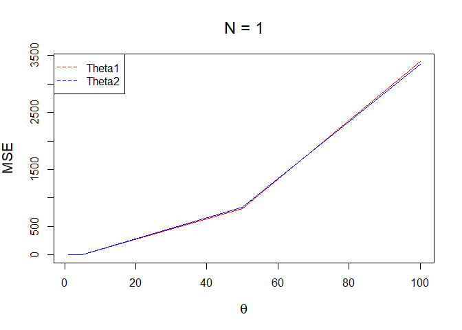
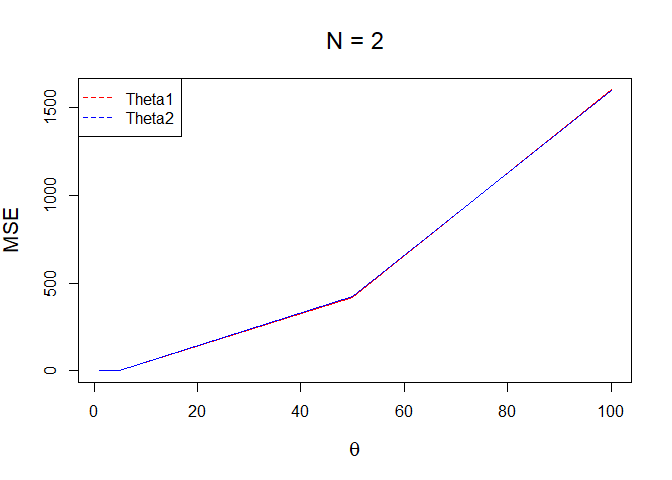
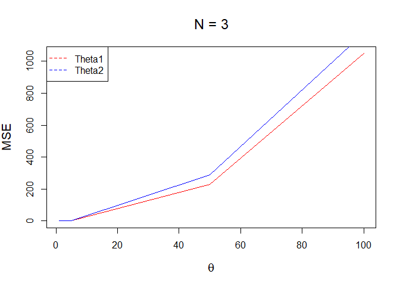
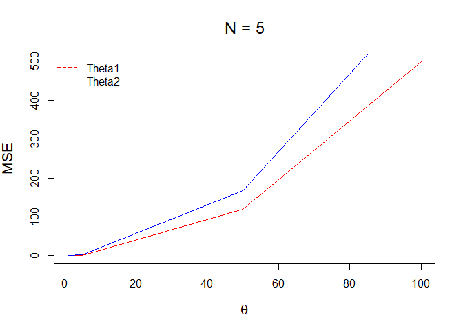
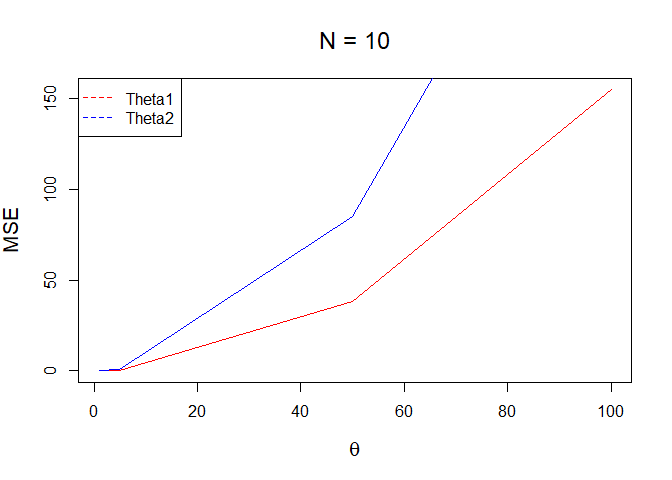
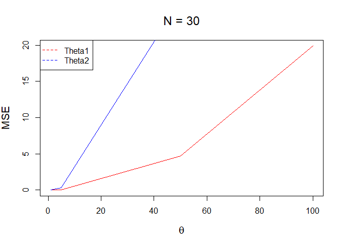

## R Markdown

**Q.1-(b) For a given combination of (n, ${\theta}$), compute the mean squared errors of both ${\hat{\theta_1}}$
and ${\hat{\theta_2}}$ using Monte Carlo simulation with N = 1000 replications. Be sure to compute both estimates from the same data.**


```r
# Estimator funtion which calculates theta hat 1(MLE) and theta hat 2 (MME)

get.estimator <- function(n, theta){
  D <- runif(n,min = 0, max = theta)      # standard uniform distibution
  theta.hat_1 <- max(D)     # MLE

  theta.hat_2 <- 2*mean(D)   # MME
  
  return (c(theta.hat_1, theta.hat_2))
}

# MSE function which computes MSE for k replications.
# Average MSE is calculated by taking average of (theta hat - theta)^2
get.mse <- function(k,n,theta){
  
  theta.hat <- replicate(k,get.estimator(n, theta))
  # Calculate theta_hat1 for each sample
  ThetaHat_1 <- max(theta.hat[1,])
  # Calculate theta_hat2 for each sample
  ThetaHat_2 <- 2*mean(theta.hat[2,])
  
  # Save the MSEs
  
  MSE.theta.1 <- mean( (theta.hat[1,] - theta)^2 )
  MSE.theta.2 <- mean( (theta.hat[2,] - theta)^2 )
  return (c(MSE.theta.1, MSE.theta.2))
}

## given N = 1000
k <- 1000

# taking n = 30, theta = 50
n <- 30
theta <- 50

MSE <- get.mse(k,n, theta)
MSE
```

```
## [1]  4.771273 27.992251
```

**Q.1-(c) Repeat (b) for the remaining combinations of (n, ${\theta}$). Summarize your results
graphically**


```r
# Estimator funtion which calculates theta hat 1(MLE) and theta hat 2 (MME)

get.estimator <- function(n, theta){
  D <- runif(n,min = 0, max = theta)      # standard uniform distibution
  theta.hat_1 <- max(D)     # MLE

  theta.hat_2 <- 2*mean(D)   # MME
  
  return (c(theta.hat_1, theta.hat_2))
}

# MSE function which computes MSE for k replications.
# Average MSE is calculated by taking average of (theta hat - theta)^2
get.mse <- function(k,n,theta){
  
  theta.hat <- replicate(k,get.estimator(n, theta))
  # Calculate theta_hat1 for each sample
  ThetaHat_1 <- max(theta.hat[1,])
  # Calculate theta_hat2 for each sample
  ThetaHat_2 <- 2*mean(theta.hat[2,])
  
  # Save the MSEs
  
  MSE.theta.1 <- mean( (theta.hat[1,] - theta)^2 )
  MSE.theta.2 <- mean( (theta.hat[2,] - theta)^2 )
  return (c(MSE.theta.1, MSE.theta.2))
}

# given N = 1000
k <- 1000

# given set of values of N and Theta
N <- c(1,2,3,5,10,30)
Theta<-c(1,5,50,100)

# for each N, graph for all theta is plotted

for(n in N){
  c = 1
  # Matrix to store MSE
  D<- matrix(0,length(Theta),2)
  
  for(theta in Theta){
    MSE <- get.mse(k,n, theta)
    MSE1 <- MSE[1]
    MSE2 <- MSE[2]
    D[c,1] <- MSE1
    D[c,2] <- MSE2
    c <- c+1
  }
  
  # Plot MLE for all theta 
  plot(Theta, D[,1], xlab=quote(theta), ylab="MSE",
       main=bquote(paste("N = ", .(n))),
       type="l", col=2, cex.lab=1.3, cex.main=1.5)
  
  # Plot MME for all theta
  lines(Theta, D[,2], col=4)
  
  legend("topleft",legend=c("Theta1", "Theta2"), col = c(2, 4),
         lty = c(2, 2),
         merge = TRUE )
  
}
```

<!-- --><!-- --><!-- --><!-- --><!-- --><!-- -->


**Q.1-d) Based on (c), which estimator is better? Does the answer depend on n or ${\theta}$? Explain. Provide justification for all your conclusions**

Method of moments is a better estimator. MSE depends on n. As n increases the value of MSE decreases.

**Q.2-c)-Even though we know the maximum likelihood estimate from (b), use the data in
(b) to obtain the estimate by numerically maximizing the log-likelihood function
using optim function in R. Do your answers match?**


```r
# Negative Log likelihood function
log.lklh.fn <- function(x, theta){ 
  return (-sum(log(theta) - (theta+1)*log((x))))
}

x <- c(21.72, 14.65, 50.42, 28.78, 11.23)
# optimization function.
# Inital value 1, x is the input data
fit<-optim(par = 1, fn = log.lklh.fn,method= "BFGS", hessian = T, x = x)
```

```
## Warning in log(theta): NaNs produced

## Warning in log(theta): NaNs produced

## Warning in log(theta): NaNs produced
```

```r
fit
```

```
## $par
## [1] 0.323387
## 
## $value
## [1] 26.10585
## 
## $counts
## function gradient 
##       22        9 
## 
## $convergence
## [1] 0
## 
## $message
## NULL
## 
## $hessian
##          [,1]
## [1,] 47.81158
```

```r
# par returns the MLE 
# The value for MLE calculated mathematically is 0.324 which close to the obtained value
```

**Use the output of numerical maximization in (c) to provide an approximate
standard error of the maximum likelihood estimate and an approximate 95\%
confidence interval for ${\theta}$. Are these approximations going to be good? Justify
your answer.**

```r
## Standard error calculation
SE= sqrt( diag(solve(fit$hessian)))

## alpha 0.05 because 95% confidence interval
alpha <- 0.05

# confidence interval is mean +/- z-score*standard error 
CI <- fit$par + c(-1, 1)*qnorm(1-(alpha/2))*SE

CI
```

```
## [1] 0.03993372 0.60684034
```

The obtained output seems appropriate approximation because 0.3 is the peak value i.e theta hat and Confidence interval is between 0.03 and 0.6.
