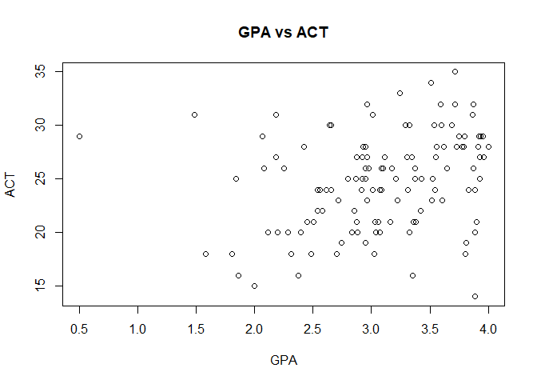
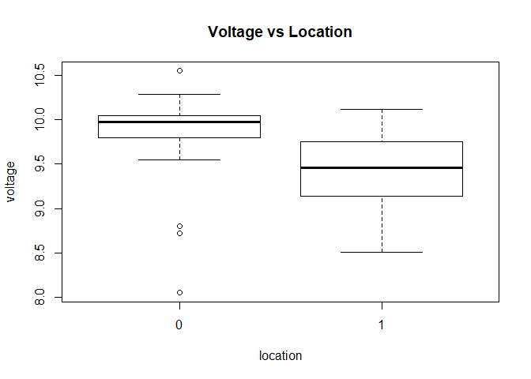
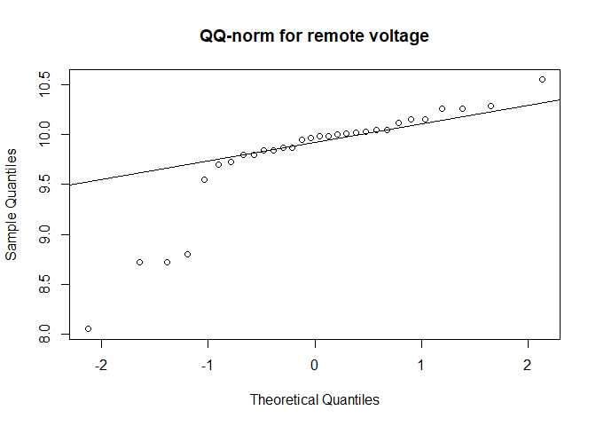
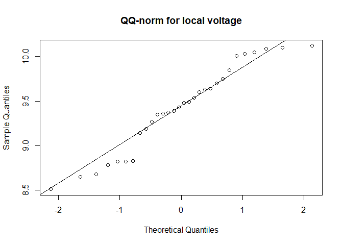
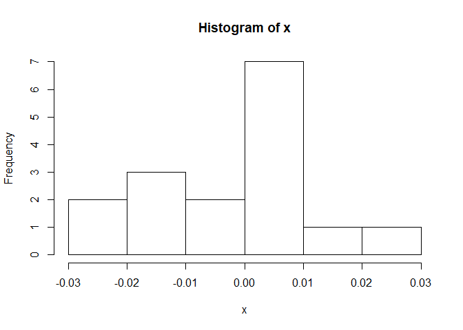

## R Markdown

**Q.1- In the class, we talked about bootstrap in the context of one-sample problems.But the idea of nonparametric bootstrap is easily generalized to more general situations. For example, suppose there are two dependent variables X1 and X2 and we have i.i.d. data on (X1,X2) from n independent subjects. In particular, the data consist of (Xi1,Xi2), i = 1,...,n, where the observations Xi1 and Xi2 come from the ith subject. Let ${\theta}$ be a parameter of interest — it’s a feature of the distribution of (X1,X2). We have an estimator ${\hat{\theta_1}}$ of ${\theta}$ that we know how to compute from the data. To obtain a draw from the bootstrap distribution of ${\hat{\theta_1}}$, all we need to do is the following: randomly select n subject IDs with replacement from the original subject IDs, extract the observations for the selected IDs (yielding a resample of the original sample), and compute the estimate from the resampled data. This process can be repeated in the usual manner to get the bootstrap distribution of ${\hat{\theta_1}}$ and obtain the desired inference. Now, consider the gpa data stored in the gpa.txt file available on eLearning. The data consist of GPA at the end of freshman year (gpa) and ACT test score (act) for randomly selected 120 students from a new freshman class. Make a scatterplot of gpa against act and comment on the strength of linear relationship between the two variables. Let $\rho$ denote the population correlation between gpa and act. Provide a point estimate of $\rho$, bootstrap estimates of bias and standard error of the point estimate, and 95% confidence interval computed using percentile bootstrap. Interpret the results. (To review population and sample correlations, look at Sections 3.3.5 and 11.1.4 of the textbook. The sample correlation provides an estimate of the population correlation and can be computed using cor function in R.)**


```r
# Reading the gpa csv data 
marks <- read.csv("data/gpa.csv")

# Plot the scatter plot between GPA and ACT
plot(x = marks$gpa,y = marks$act,
     xlab = "GPA",
     ylab = "ACT",
     main = "GPA vs ACT"
)
```

<!-- -->

```r
# finding correlation between gpa and act
cor(marks$gpa, marks$act)
```

```
## [1] 0.2694818
```

My observation :
The correlation between GPA and ACT is not very strong. We created the plot for the whole population. 
Now we will calculate estimate for correlation resamples.


```r
library(boot)

n = length(marks)
# Function calculates pearson correlation between GPA and ACT
pearson <- function(d,i=c(1:n)){
  d2 <- d[i,]
  return(cor(d2$gpa,d2$act))
}

# Boot function call to calulcate correlation of 999 samples
bootcorr <- boot(data=marks,statistic=pearson,R=999, sim = "ordinary", stype = "i")
bootcorr
```

```
## 
## ORDINARY NONPARAMETRIC BOOTSTRAP
## 
## 
## Call:
## boot(data = marks, statistic = pearson, R = 999, sim = "ordinary", 
##     stype = "i")
## 
## 
## Bootstrap Statistics :
##      original       bias    std. error
## t1* 0.2694818 -0.003530408   0.1111014
```

My observation :
We can see that the correlation estimate is 0.26.


```r
# See the bootstrap distribution of correlation estimate

plot(bootcorr)
```

<!-- -->


```r
# Calculating bootstrap confidence intervals
boot.ci(boot.out = bootcorr)
```

```
## Warning in boot.ci(boot.out = bootcorr): bootstrap variances needed for
## studentized intervals
```

```
## BOOTSTRAP CONFIDENCE INTERVAL CALCULATIONS
## Based on 999 bootstrap replicates
## 
## CALL : 
## boot.ci(boot.out = bootcorr)
## 
## Intervals : 
## Level      Normal              Basic         
## 95%   ( 0.0553,  0.4908 )   ( 0.0545,  0.4903 )  
## 
## Level     Percentile            BCa          
## 95%   ( 0.0487,  0.4845 )   ( 0.0370,  0.4678 )  
## Calculations and Intervals on Original Scale
```


```r
# The 95% confidence interval is :
sort(bootcorr$t)[c(25, 975)]
```

```
## [1] 0.04868005 0.48447603
```

My observation :
Our null hypothesis was that there is correlation between GPA and ACT. From the confidence interval we observe that zero does not lie in the interval. Thus we reject the null hypothesis.
There is no correlation or a weak correlation between the two.

**Q.2)Consider the data stored in the file VOLTAGE.DAT on eLearning. These data come from a Harris Corporation/University of Florida study to determine whether a manufacturing process performed at a remote location can be established locally. Test devices (pilots) were set up at both the remote and the local locations and voltage readings on 30 separate production runs at each location were obtained. In the dataset, the remote and local locations are indicated as 0 and 1, respectively.**

**(a) (1 points) Perform an exploratory analysis of the data by examining the distributions of the voltage readings at the two locations. Comment on what you see. Do the two distributions seem similar? Justify your answer.**

We can do exploratory analysis by making boxplot and Q-Q plot

```r
# Reading the voltage csv data 
v <- read.csv("data/voltage.csv")
# Remote voltage
voltage_remote <- v$voltage[v$location == 0] 
# Local voltage
voltage_local <- v$voltage[v$location == 1]

# Boxplot of voltage with location
boxplot(voltage~location,data=v, main = "Voltage vs Location")
```

<!-- -->


```r
# Q-Q plot of remote voltage
qqnorm(voltage_remote,main="QQ-norm for remote voltage")
qqline(voltage_remote)
```

<!-- -->

```r
# Q-Q plot of local voltage
qqnorm(voltage_local,main="QQ-norm for local voltage") 
qqline(voltage_local)
```

<!-- -->

From the following Q-Q plots and boxplots of voltage at remote location and voltage at local location, we can observe that there is dissimilarity between the voltages of two locations.

**(b) (5 points) The manufacturing process can be established locally if there is no difference in the population means of voltage readings at the two locations. Does it appear that the manufacturing process can be established locally? Answer this question by constructing an appropriate confidence interval. Clearly state the assumptions, if any, you may be making and be sure to verify the assumptions.**


```r
# Variance of voltage at local location
cat("Voltage at local location ", var(voltage_local))
```

```
## Voltage at local location  0.229322
```

```r
# Variance of voltage at remote location
cat("Voltage at remote location ", var(voltage_remote))
```

```
## Voltage at remote location  0.2925895
```

My observation :
Since the two variances are different so we find confidence interval for difference in mean. 
Assuming normality we will be using Welch's two sided t-test.

**(c) (1 point) How does your conclusion in (b) compare with what you expected from the exploratory analysis in (a)?**

```r
# two sided t-test with unequal variance and 95% confidence interval
t.test(voltage_remote, voltage_local, alternative = "two.sided", conf.level = 0.95, var.equal = FALSE)
```

```
## 
## 	Welch Two Sample t-test
## 
## data:  voltage_remote and voltage_local
## t = 2.8911, df = 57.16, p-value = 0.005419
## alternative hypothesis: true difference in means is not equal to 0
## 95 percent confidence interval:
##  0.1172284 0.6454382
## sample estimates:
## mean of x mean of y 
##  9.803667  9.422333
```

My observation :
We observe that 0 does not lie in the confidence interval, we can say that the difference in population means of voltages at two locations will not be 0.  
Verifying the results using theoretical calculations:


```r
# mean remote voltage
mean_vol_remote <- mean(voltage_remote) 
# mean local voltage
mean_vol_local <- mean(voltage_local) 
# confidence interval calculation
ci <- (mean_vol_remote - mean_vol_local) +c(-1,1)*qt(0.025,58)*sqrt((var(voltage_local) + var(voltage_remote))/30) 
ci
```

```
## [1] 0.6453556 0.1173110
```

My observation :
We observe that the theoretical values match with the confidence interval obtained from the t-test function.
The confidence interval obtained from the t-test function shows that 0 does not lie in the interval. This negates the null hypothesis. Our null hypothesis stated that there is no difference between local and remote voltage. Our obtained results clearly show the opposite. Thus we have sufficient evidence to conclude that manufacturing process performed remotely cannot be performed locally.

**Q.3) (7 points) The file VAPOR.DAT on eLearning provide data on theoretical (calculated) and experimental values of the vapor pressure for dibenzothiophene, a heterocycloaromatic compound similar to those found in coal tar, at given values of temperature. If the theoretical model for vapor pressure is a good model of reality, the true mean difference between the experimental and calculated values of vapor pressure will be zero. Perform an appropriate analysis of these data to see whether or not this is the case. Be sure to justify all the steps in the analysis.**


```r
# Read vapor csv data
vapor = read.csv("data/vapor.csv")

# Calculate difference between theoretical and experimental values of vapor
x = vapor$theoretical - vapor$experimental 

x
```

```
##  [1]  0.006  0.007 -0.015  0.014 -0.022  0.008  0.000  0.002 -0.026  0.029
## [11]  0.008  0.000 -0.010  0.010 -0.010  0.010
```


```r
# Plotting the histogram of difference
hist(x)
```

<!-- -->

My observation :
We observe that the data is not exactly normal. Since the theoretical and experimental values were calculated on the same set of temperatures its matched pair sampling. Assuming normality and applying two sided t-test:


```r
# Performing one-sample t-test where population is difference of two distributions
t.test(x)
```

```
## 
## 	One Sample t-test
## 
## data:  x
## t = 0.19344, df = 15, p-value = 0.8492
## alternative hypothesis: true mean is not equal to 0
## 95 percent confidence interval:
##  -0.006887694  0.008262694
## sample estimates:
## mean of x 
## 0.0006875
```

My observation :
We observe that p-value is greater than 0.05 and 0 lies in the confidence interval. Thus we have sufficient evidence to accept the null hypothesis. The null hypothesis is that there is no difference between the two distributions which is clearly indicated by the obtained results.
We can also notice that the mean of the difference between the two distributions is very close to 0 which is another evidence to accept the null hypothesis.
We conclude that theoretical model for vapor pressure is a good model of reality.
