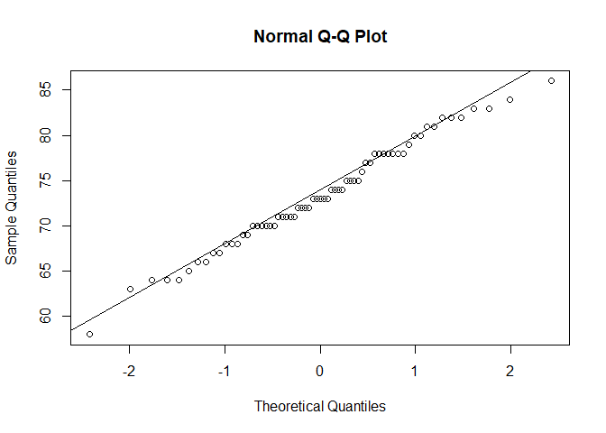

## R Markdown

**Q.1- Consider the data stored in bodytemp-heartrate.csv on eLearning, containing measurements of body temperature and heart rate for 65 male (gender = 1) and 65 female (gender = 2) subjects.**
**(a) Do males and females differ in mean body temperature? Answer this question by performing an appropriate analysis of the data, including an exploratory analysis.**


```r
data = read.csv("data/bodytemp-heartrate.csv")

#split dataframe into male and female subsets
male_data = data[data$gender==1,]
female_data = data[data$gender==2,]

#function that calculates a samples T-Score
#will be used later to calculate P values
tscore.pooled.var = function(x,y){
  mux = mean(x); muy = mean(y)
  sdx = sd(x); sdy = sd(y)
  n = length(x); m = length(y)
  
  tscore = (mux-muy)/sqrt((sdx^2*(n-1)+sdy^2*(m-1))/(n+m-2))
  return(tscore)
}
```

My observation :
The correlation between GPA and ACT is not very strong. We created the plot for the whole population. 
Now we will calculate estimate for correlation resamples.

**a)** 

```r
#get lengths of both samples
n = length(male_data$heart_rate); m = length(female_data$heart_rate)

#histograms of male and female body temperatures
hist(male_data$body_temperature, probability = T, main = "Male Body Temperature Histogram",
     xlab="Body Temperature")
```

<!-- -->

```r
hist(female_data$body_temperature, probability = T, 
     main = "Female Body Temperature Histogram", xlab="Body Temperature")
```

<!-- -->

```r
#QQ Normal Plots for male and female body temperatures 
qqnorm(male_data$body_temperature); qqline(male_data$body_temperature)
```

<!-- -->

```r
qqnorm(female_data$body_temperature); qqline(female_data$body_temperature)
```

<!-- -->

```r
#boxplot of male and female body temperatures
boxplot(male_data$body_temperature,female_data$body_temperature, names = c("male", "female"))
```

<!-- -->

```r
#average male and female body temperatures
mean(male_data$body_temperature)
```

```
## [1] 98.10462
```

```r
mean(female_data$body_temperature)
```

```
## [1] 98.39385
```

```r
#calculate T-Score of the diffence between the mean males and female body temperatures
tscore.body_temp = tscore.pooled.var(male_data$body_temperature, female_data$body_temperature)
#calculate the P-Value or significance of the observed difference
2*(1-(pt(abs(tscore.body_temp), n+m-2)))
```

```
## [1] 0.6891682
```

b)


```r
#histograms of male and female heart rates
hist(male_data$heart_rate, probability = T, main = "Male Heart Rate Histogram",
     xlab="Heart Rate")
```

<!-- -->

```r
hist(female_data$body_temperature, probability = T, main = "Female Heart Rate Histogram",
     xlab="Heart Rate")
```

<!-- -->

```r
#QQ Normal Plots for male and female heart rates 
qqnorm(male_data$heart_rate); qqline(male_data$heart_rate)
```

<!-- -->

```r
qqnorm(female_data$heart_rate); qqline(female_data$heart_rate)
```

<!-- -->

```r
#boxplot of male and female heart rates 
boxplot(male_data$heart_rate,female_data$heart_rate, names = c("male", "female"))
```

<!-- -->

```r
#average male and female heart reates
mean(male_data$heart_rate)
```

```
## [1] 73.36923
```

```r
mean(female_data$heart_rate)
```

```
## [1] 74.15385
```

```r
#calculate T-Score of the diffence between the mean males and female body temperatures
tscore.heart_rate = tscore.pooled.var(male_data$heart_rate, female_data$heart_rate)
#calculate the P-Value or significance of the observed difference
2*(1-(pt(abs(tscore.heart_rate), n+m-2)))
```

```
## [1] 0.9119139
```

**c)**


```r
#Plot Heart Rate over Body Temperature for the full sample
plot(data$body_temperature, data$heart_rate, ylab="Heart Rate", xlab="Body Temperature",
     main="Full Sample")
#add the regression line
abline(lm(data$heart_rate~data$body_temperature))
```

<!-- -->

```r
#correlation coefficient
cor(data$body_temperature, data$heart_rate)
```

```
## [1] 0.2536564
```

```r
#Regression coefficients for b0 and b1
lm(data$heart_rate~data$body_temperature)
```

```
## 
## Call:
## lm(formula = data$heart_rate ~ data$body_temperature)
## 
## Coefficients:
##           (Intercept)  data$body_temperature  
##              -166.285                  2.443
```

```r
#Plot Heart Rate over Body Temperature for the male sample
plot(male_data$body_temperature, male_data$heart_rate, 
     ylab="Heart Rate", xlab="Body Temperature", main="Male Sample")
#add the regression line
abline(lm(male_data$heart_rate~male_data$body_temperature))
```

<!-- -->

```r
#correlation coefficient
cor(male_data$body_temperature, male_data$heart_rate)
```

```
## [1] 0.1955894
```

```r
#Regression coefficients for b0 and b1
lm(male_data$heart_rate~male_data$body_temperature)
```

```
## 
## Call:
## lm(formula = male_data$heart_rate ~ male_data$body_temperature)
## 
## Coefficients:
##                (Intercept)  male_data$body_temperature  
##                    -87.967                       1.645
```

```r
#Plot Heart Rate over Body Temperature for the female sample
plot(female_data$body_temperature, female_data$heart_rate, 
     ylab="Heart Rate", xlab="Body Temperature", main="Female Sample")
#add the regression line
abline(lm(female_data$heart_rate~female_data$body_temperature))
```

<!-- -->

```r
#correlation coefficient
cor(female_data$body_temperature, female_data$heart_rate)
```

```
## [1] 0.2869312
```

```r
#Regression coefficients for b0 and b1
lm(female_data$heart_rate~female_data$body_temperature)
```

```
## 
## Call:
## lm(formula = female_data$heart_rate ~ female_data$body_temperature)
## 
## Coefficients:
##                  (Intercept)  female_data$body_temperature  
##                     -233.624                         3.128
```

**2. The goal of this exercise to see how large n should be for the large-sample and the (parametric) bootstrap percentile method confidence intervals for the mean of an exponential population to be accurate. To be specific, let X1,...,Xn represent a random sample from an exponential (λ) distribution. Note that this distribution is skewed and its mean is µ = 1/λ. We can construct two confidence intervals for µ — one the large-sample z-interval (interval 1) and the other a (parametric) bootstrap percentile method interval (interval 2). We would like to investigate their accuracy, i.e., how close their estimated coverage probabilities are to the assumed nominal level of confidence, for various combinations of (n,λ). This investigation will focus on 1−α = 0.95, λ = 0.01,0.1,1,10 and n = 5,10,30,100. Thus, we have a total of 4∗4 = 16 combinations of (n,λ) to investigate.**
**(a) For a given setting, compute Monte Carlo estimates of coverage probabilities of the two intervals by simulating appropriate data, using them to construct the two confidence intervals, and repeating the process 5000 times. **
**(b) Repeat (a) for the remaining combinations of (n,λ). Present an appropriate summary of the results. **
**(c) Interpret all the results. Be sure to answer the following questions: In case of the large-sample interval, how large n is needed for the interval to be accurate? Likewise, in case of the bootstrap interval, how large n is needed for the interval to be accurate? Do these answers depend on λ? Can we say that one method is more accurate than the other? Which interval would you recommend? Provide justification for all your conclusions. **
**(d) Do your conclusions in (c) depend on the specific values of λ that were fixed in advance? Explain.**


```r
#function computes the z-interval
zinterval = function(x, alpha){
  mu = mean(x); 
  #sd() calculates the Sample Std Deviation, sigma is the Standard Deviation
  sigma = sqrt(sum((x-mu)^2)/length(x))
  std.error = sigma/sqrt(length(x))
  
  #produces two tailed 1-aplha CI
  return(mu + c(-1,1)*qnorm(1-alpha/2)*std.error)
}

#function computes the percentiles from bootstrapped means
boot.percentile = function(x, alpha){
  #calculated 999 means
  b = replicate(999,mean(sample(x, replace = T)))
  #get the 2.5% and 97.5% quantiles
  return(quantile(b, c(alpha/2, 1-alpha/2)))
}


#gets a sample size from exp distribution and calculates the CI resulting from
#both methods then determines if the CI covers the actual mean
#also returns the length of both intervals
coverage.sim = function(n, lambda, alpha){
  #sample from distribution
  Xi = rexp(n, lambda)
  #calculate mean
  mu = 1/lambda
  
  #calculate CI intervals from Z-Test and Percentile Boot 
  CI_z = zinterval(Xi, alpha)
  CI_p = boot.percentile(Xi, alpha)
  
  #Check to see if either interval covers the actual mean
  z_coverage = 0
  if(CI_z[1] < mu & CI_z[2] > mu){z_coverage = 1}
  p_coverage = 0
  if(CI_p[1] < mu & CI_p[2] > mu){p_coverage = 1}

  #return the coverage the and the length (or precision) of the CI's
  return(c(z_coverage, p_coverage, CI_z[2]-CI_z[1], CI_p[2]-CI_p[1]))
}

#run the coverage comparisons and CI length Comparison for 5000 Monte Carlo Trials
mc.coverage.ratio = function(n, lambda, alpha){
  #MC Trials
  mc_trials = replicate(5000, coverage.sim(n, lambda, alpha))
  
  #output results
  return(c(sum(mc_trials[1,])/length(mc_trials[1,]) , sum(mc_trials[2,])/length(mc_trials[2,]), 
           mean(mc_trials[3,]), mean(mc_trials[4,])))
}

#resulting coverages for n = 30 and lambda = 1
mc.coverage.ratio(30, 1, 0.05)
```

```
## [1] 0.9176000 0.9194000 0.6884047 0.6819536
```

```r
#make 2 empty matrices for both coverages
z_coverage_matirx = matrix(nrow=4, ncol=4)
p_coverage_matirx = matrix(nrow=4, ncol=4)

#all values for lambda and n to test for
lambda.vector = c(0.01, 0.1, 1, 10)
n.vector = c(5, 10, 30, 100)

#for each value n and lambda, run 5000 MC trials and estimate the coverage
#put both coverages in a matrix
row = 1
col = 1
for(l in lambda.vector){
  col = 1
  for(n in n.vector){
    coverages = mc.coverage.ratio(n, l, 0.05)
    print(row)
    z_coverage_matirx[row, col] = coverages[1]
    p_coverage_matirx[row, col] = coverages[2]
    col = col + 1
  }
  row = row + 1
}
```

```
## [1] 1
## [1] 1
## [1] 1
## [1] 1
## [1] 2
## [1] 2
## [1] 2
## [1] 2
## [1] 3
## [1] 3
## [1] 3
## [1] 3
## [1] 4
## [1] 4
## [1] 4
## [1] 4
```

```r
#coverage matrices for the Z-Test and Percentile Bootstrap
z_coverage_matirx
```

```
##        [,1]   [,2]   [,3]   [,4]
## [1,] 0.7792 0.8674 0.9138 0.9306
## [2,] 0.7778 0.8706 0.9176 0.9380
## [3,] 0.7748 0.8566 0.9142 0.9352
## [4,] 0.7950 0.8602 0.9144 0.9356
```

```r
p_coverage_matirx
```

```
##        [,1]   [,2]   [,3]   [,4]
## [1,] 0.7810 0.8708 0.9168 0.9300
## [2,] 0.7802 0.8768 0.9210 0.9394
## [3,] 0.7702 0.8618 0.9192 0.9374
## [4,] 0.7890 0.8644 0.9162 0.9358
```

```r
#output both matrices to a csv for ease of access for reporting
# write.csv(data.frame(z_coverage_matirx), 
#           "data/z_out.csv")
# write.csv(data.frame(p_coverage_matirx), 
#           "data/p_out.csv")
```
