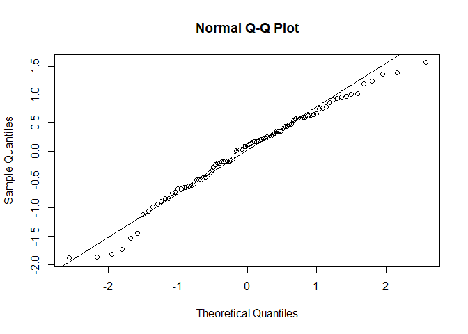

## R Markdown

**Q.1- Consider the prostate cancer dataset available on eLearning as prostate cancer.csv. It consists of data on 97 men with advanced prostate cancer. A description of the variables is given in Figure 1. We would like to understand how PSA level is related to the other predictors in the dataset. Note that vesinv is a qualitative variable. You can treat gleason as a quantitative variable. Build a “reasonably good” linear model for these data by taking PSA level as the response variable. Carefully justify all the choices you make in building the model. Be sure to verify the model assumptions. In case a transformation of response is necessary, try the natural log transformation. Use the final model to predict the PSA level for a patient whose quantitative predictors are at the sample means of the variables and qualitative predictors are at the most frequent category.**


```r
#Dataset imported and stored in data        
cancer_data <- read.csv("data/prostate_cancer.csv",header = T, sep = ',')

# side by side plots
par(mfrow=c(1,2))
boxplot(cancer_data$psa, main = "Boxplot of PSA")
qqnorm(cancer_data$psa)
qqline(cancer_data$psa)
```

<!-- -->

My observation :
The boxplot seems to have a lot of outliers and the points on the qqplot do not fit the qqline this implies the data is not normal.  
We use logarithmic transformation of these values for better fit.
Now drawing the boxplot and qqplot for log(psa), we get 


```r
# side by side plots
par(mfrow=c(1,2))
boxplot(log(cancer_data$psa), main = "Boxplot of log(PSA)")
qqnorm(log(cancer_data$psa))
```

<!-- -->

```r
line(log(cancer_data$psa))
```

```
## 
## Call:
## line(log(cancer_data$psa))
## 
## Coefficients:
## [1]  0.92890  0.03203
```

My observation :
We see now that the boxplot seem to have less outliers than before and also seems symmetrical. And the qqplot appears to be normal. 
 
Now we draw the scatterplots of each and every predictor against the y, so as to find on which predictors y seems to depend on  


```r
#Lmplot to plot a linear model of heart rate vs body temperature
 par(mfrow = c(2,4))
 y <- log(cancer_data$psa)
 plot(cancer_data$cancervol,y)
 fit1 <- lm(y ~ cancervol, data = cancer_data)
 abline(fit1)
 plot(cancer_data$weight, y)
 fit2 <- lm(y ~ weight, data = cancer_data)
 abline(fit2)
 plot(cancer_data$age, y)
 fit3 <- lm(y ~ age, data = cancer_data)
 abline(fit3)
 plot(cancer_data$benpros, y)
 fit4 <- lm(y ~ benpros, data = cancer_data)
 abline(fit4)
 plot(cancer_data$vesinv, y)
 fit5 <- lm(y ~ vesinv, data = cancer_data)
 abline(fit5)
 plot(cancer_data$capspen, y)
 fit6 <- lm(y ~ capspen, data = cancer_data) 
 abline(fit6)
 plot(cancer_data$gleason, y)
 fit7 <- lm(y ~ gleason, data = cancer_data)
 abline(fit7)
```

<!-- -->


```r
library(GGally)
```

```
## Loading required package: ggplot2
```

```
## Registered S3 method overwritten by 'GGally':
##   method from   
##   +.gg   ggplot2
```

```r
ggpairs(data=cancer_data, columns=c(1:9), title="PSA vs all predictors")
```

<!-- -->
As we can see from the above correlation plot that cancervol, benpros, gleason and vesinv (treated as a categorical variable) are highly correlated to PSA.

We use automated techniques in R to get the models best suited for the given data. The function we use for that is step.
 
Doing the forward stepwise search we end up with a linear model which includes the predictors – cancervol, benpros, gleason and vesinv (treated as a categorical variable). 


```r
# automated techniques for models
 fit8.forward <- step(lm(y ~ 1, data = cancer_data), scope = list(upper = ~ cancervol + weight + age + benpros + as.factor(vesinv) + capspen + gleason), direction = "forward")
```

```
## Start:  AIC=28.72
## y ~ 1
## 
##                     Df Sum of Sq     RSS      AIC
## + cancervol          1    55.164  72.605 -24.0986
## + as.factor(vesinv)  1    40.984  86.785  -6.7944
## + gleason            1    37.122  90.647  -2.5707
## + capspen            1    34.286  93.482   0.4169
## + age                1     3.688 124.080  27.8831
## + benpros            1     3.166 124.603  28.2911
## <none>                           127.769  28.7246
## + weight             1     1.893 125.876  29.2767
## 
## Step:  AIC=-24.1
## y ~ cancervol
## 
##                     Df Sum of Sq    RSS     AIC
## + gleason            1    8.2468 64.358 -33.794
## + benpros            1    7.8034 64.802 -33.128
## + as.factor(vesinv)  1    6.5468 66.058 -31.265
## + age                1    2.6615 69.944 -25.721
## + weight             1    1.7901 70.815 -24.520
## <none>                           72.605 -24.099
## + capspen            1    0.9673 71.638 -23.400
## 
## Step:  AIC=-33.79
## y ~ cancervol + gleason
## 
##                     Df Sum of Sq    RSS     AIC
## + benpros            1    6.2827 58.075 -41.758
## + as.factor(vesinv)  1    4.0178 60.340 -38.047
## + weight             1    2.0334 62.325 -34.908
## <none>                           64.358 -33.794
## + age                1    0.9611 63.397 -33.253
## + capspen            1    0.1685 64.190 -32.048
## 
## Step:  AIC=-41.76
## y ~ cancervol + gleason + benpros
## 
##                     Df Sum of Sq    RSS     AIC
## + as.factor(vesinv)  1    4.8466 53.229 -48.211
## <none>                           58.075 -41.758
## + weight             1    0.4006 57.675 -40.429
## + capspen            1    0.1863 57.889 -40.069
## + age                1    0.0059 58.070 -39.768
## 
## Step:  AIC=-48.21
## y ~ cancervol + gleason + benpros + as.factor(vesinv)
## 
##           Df Sum of Sq    RSS     AIC
## <none>                 53.229 -48.211
## + capspen  1   0.39230 52.837 -46.928
## + weight   1   0.33060 52.898 -46.815
## + age      1   0.02497 53.204 -46.256
```

Now using the automated techniques, the downfall is that we may get over fitted models which fit the data at hand perfectly but are not so good at predicting the future values.  
 
Hence we try to verify the model by eliminating few of the predictors.

We do so by generating models which have one less model than the model generated by the automated methods and then use the anova function which compare analysis of variances for one or more fitted models.  


```r
# using anova to verify whether to kick out few indicators in the assumption that forward
 # stepwise fit gave an overfitted model
 fit9 <- lm(y ~ gleason + benpros + as.factor(vesinv), data = cancer_data)
 anova(fit9, fit8.forward)
```

```
## Analysis of Variance Table
## 
## Model 1: y ~ gleason + benpros + as.factor(vesinv)
## Model 2: y ~ cancervol + gleason + benpros + as.factor(vesinv)
##   Res.Df    RSS Df Sum of Sq      F   Pr(>F)    
## 1     93 67.987                                 
## 2     92 53.229  1    14.758 25.508 2.22e-06 ***
## ---
## Signif. codes:  0 '***' 0.001 '**' 0.01 '*' 0.05 '.' 0.1 ' ' 1
```

```r
  fit10 <- lm(y ~ cancervol + benpros + as.factor(vesinv), data = cancer_data)
 anova(fit10, fit8.forward)
```

```
## Analysis of Variance Table
## 
## Model 1: y ~ cancervol + benpros + as.factor(vesinv)
## Model 2: y ~ cancervol + gleason + benpros + as.factor(vesinv)
##   Res.Df    RSS Df Sum of Sq      F Pr(>F)   
## 1     93 57.468                              
## 2     92 53.229  1    4.2389 7.3264 0.0081 **
## ---
## Signif. codes:  0 '***' 0.001 '**' 0.01 '*' 0.05 '.' 0.1 ' ' 1
```

```r
  fit11 <- lm(y ~ cancervol + gleason + as.factor(vesinv), data = cancer_data)
 anova(fit11, fit8.forward)
```

```
## Analysis of Variance Table
## 
## Model 1: y ~ cancervol + gleason + as.factor(vesinv)
## Model 2: y ~ cancervol + gleason + benpros + as.factor(vesinv)
##   Res.Df    RSS Df Sum of Sq      F    Pr(>F)    
## 1     93 60.340                                  
## 2     92 53.229  1    7.1115 12.291 0.0007054 ***
## ---
## Signif. codes:  0 '***' 0.001 '**' 0.01 '*' 0.05 '.' 0.1 ' ' 1
```

```r
 fit12 <- lm(y ~ cancervol + gleason + benpros, data = cancer_data)
 anova(fit12, fit8.forward)
```

```
## Analysis of Variance Table
## 
## Model 1: y ~ cancervol + gleason + benpros
## Model 2: y ~ cancervol + gleason + benpros + as.factor(vesinv)
##   Res.Df    RSS Df Sum of Sq      F   Pr(>F)   
## 1     93 58.075                                
## 2     92 53.229  1    4.8466 8.3767 0.004746 **
## ---
## Signif. codes:  0 '***' 0.001 '**' 0.01 '*' 0.05 '.' 0.1 ' ' 1
```

Using Anova, results we found that the best model that fits the given data has the indicators cancervol, benpros, gleason and vesinv 


```r
# Summary for the fitted model
 summary(fit8.forward)
```

```
## 
## Call:
## lm(formula = y ~ cancervol + gleason + benpros + as.factor(vesinv), 
##     data = cancer_data)
## 
## Residuals:
##      Min       1Q   Median       3Q      Max 
## -1.88531 -0.50276  0.09885  0.53687  1.56621 
## 
## Coefficients:
##                    Estimate Std. Error t value Pr(>|t|)    
## (Intercept)        -0.65013    0.80999  -0.803 0.424253    
## cancervol           0.06488    0.01285   5.051 2.22e-06 ***
## gleason             0.33376    0.12331   2.707 0.008100 ** 
## benpros             0.09136    0.02606   3.506 0.000705 ***
## as.factor(vesinv)1  0.68421    0.23640   2.894 0.004746 ** 
## ---
## Signif. codes:  0 '***' 0.001 '**' 0.01 '*' 0.05 '.' 0.1 ' ' 1
## 
## Residual standard error: 0.7606 on 92 degrees of freedom
## Multiple R-squared:  0.5834,	Adjusted R-squared:  0.5653 
## F-statistic: 32.21 on 4 and 92 DF,  p-value: < 2.2e-16
```

The p-value is greater than 0.05 and the F-statistic is large which is in favour of null hypothesis. There is not sufficient evidence to rule out this model.

Now to verify the model quality we check the residual plot for the given model

Drawing the scatter plot, qqplot and time series plots of the residuals we get:


```r
# Drawing scatter plot, qqplot and time series plot for residuals
 par(mfrow=c(1,1))
 plot(fitted(fit8.forward), resid(fit8.forward), main="Scatter Plot of Residuals")
 abline(h = 0)
```

<!-- -->

```r
 qqnorm(resid(fit8.forward))
 qqline(resid(fit8.forward))
```

<!-- -->

We observe that the residuals are scattered throughout and the points fit the qq line very well. This implies "goodness of fit".


```r
plot(resid(fit8.forward), type = 'l', main = "Time Series Plot for Residuals")
 abline(h=0)
```

<!-- -->

The above three graphs show that the error quantities have zero mean, constant variance, are normally distributed and are independent.


```r
# Predicting new value using the regression equation at the sample means of indicators
  prediction = fit8.forward$coefficients["(Intercept)"] +
(fit8.forward$coefficients["cancervol"]*mean(cancer_data$cancervol)) +
(fit8.forward$coefficients["benpros"]*mean(cancer_data$benpros)) +
(fit8.forward$coefficients["as.factor(vesinv)1"]*unique(cancer_data$vesinv)[which.max(tabulate(match(cancer_data$vesinv, unique(cancer_data$vesinv))))]) +
(fit8.forward$coefficients["gleason"]*mean(cancer_data$gleason))
 prediction
```

```
## (Intercept) 
##    2.330541
```

Predicted output is  2.330541
However as we had taken the log transformation earlier for the psa values, the value we have predicted is the log of the needed value. So computing antilog of the value, we get our actual predicted value which is 10.2835
